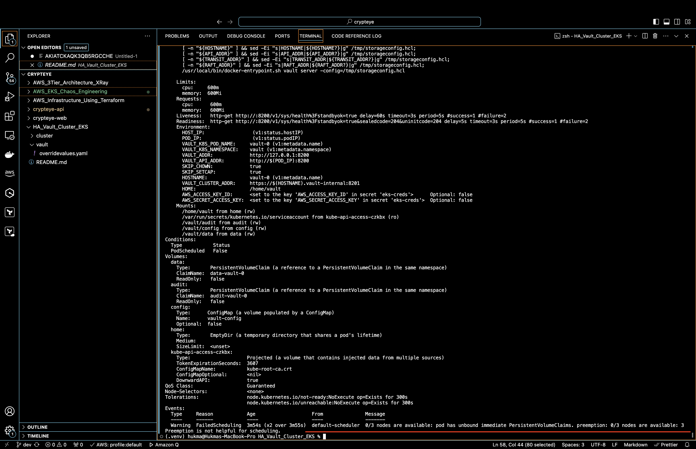

# Setup a High Availability (Multi-AZ) Vault Cluster in AWS EKS with Auto-Unseal and Integrated Storage (Raft)

HashiCorp Vault is an open-source solution that securely stores and manages sensitive information, such as API keys, access tokens, and passwords. It offers robust policy management, secret leasing, audit logging, and automatic revocation, accessible through a user interface, command-line interface, or HTTP API.

## High Availability

Vault supports High Availability (HA) mode to ensure resilience against outages by operating multiple Vault servers. In HA mode, servers can be in one of two states: active or standby. Within a Vault cluster, only one instance is active and processes all requests, while standby instances forward requests to the active instance.

## Integrated Storage Raft

The Integrated Storage backend manages Vault's data by maintaining replicated copies across all nodes in the cluster. Unlike other storage solutions, Integrated Storage doesn't rely on a single data source. Instead, it uses the Raft Consensus Algorithm to replicate data across all nodes within the Vault cluster.


Follow the steps below to set up the vault cluster:

## Steps

1. **Create an EKS Cluster Using Terraform**

   Navigate to the `cluster` folder and run the following commands:

   ```
   terraform init
   terraform plan
   terraform apply
   ```

   This will create a cluster named `vault-cluster`. You can update the cluster name and other variables in the `variables.tf` file.

2. **Install Required Tools**

   Download and install the AWS CLI, eksctl, and kubectl locally if they are not already installed. Configure them for use.

3. **Configure kubectl to Access the Cluster**

   Run the following command to update your kubeconfig:

   ```
   aws eks update-kubeconfig --region us-east-1 --name vault-cluster
   ```

4. **Change the kubectl Context**

   Check the contexts and switch to the vault-cluster context:

   ```
   kubectl config get-contexts
   ```

   ```
   kubectl config use-context context_name
   ```

   Also, create a namespace named `vault` in the cluster:

   ```
   kubectl create namespace vault
   ```

5. **Create an OIDC Provider**

   Create an OIDC provider to use IAM roles in the EKS cluster:

   ```
   eksctl utils associate-iam-oidc-provider --cluster vault-cluster --approve
   ```

   Verify the provider by running:

   ```
   aws iam list-open-id-connect-providers
   ```

6. **Enable Volume Support with the EBS CSI Driver Add-on**

   Run the following commands:

   ```
   eksctl create iamserviceaccount \
   --name ebs-csi-controller-sa \
   --namespace kube-system \
   --cluster vault-cluster \
   --attach-policy-arn arn:aws:iam::aws:policy/service-role/AmazonEBSCSIDriverPolicy \
   --approve \
   --role-only \
   --role-name AmazonEKS_EBS_CSI_DriverRole --region us-east-1
   ```

   ```
   eksctl create addon \
   --name aws-ebs-csi-driver \
   --cluster vault-cluster \
   --service-account-role-arn arn:aws:iam::$(aws sts get-caller-identity --query Account --output text):role/AmazonEKS_EBS_CSI_DriverRole --region us-east-1
   ```

7. **Add the Helm Repository**

   Add the HashiCorp Helm repository:

   ```
   helm repo add hashicorp https://helm.releases.hashicorp.com
   ```

8. **Create an AWS KMS Key**

   Create an AWS KMS key and note down the Key ID.

9. **Create IAM Access Key and Secret Key**

   Using the IAM console, create an access key and secret key for vault to use. Then, create a Kubernetes secret in the cluster with the AWS access key and secret key:

   ```
   kubectl create secret generic -n default eks-creds \
   --from-literal=AWS_ACCESS_KEY_ID="" \
   --from-literal=AWS_SECRET_ACCESS_KEY="" -n vault
   ```

10. **Override the Default Values File for Vault**

    Vault is launched in a single pod by default. To make it highly available and use integrated storage, override the default values file (overridevalues.yaml). Add the KMS ID in line 98 for auto-unseal.

11. **Install Vault Using Helm**

    Install Vault by providing the overridevalues.yaml:

```
helm install vault hashicorp/vault \
-f ./vault/overridevalues.yaml -n vault
```

12. **Handling PVC Issues**

If the PVC is unable to create and is stuck, delete the existing storage class and recreate it with the binding mode set to Immediate using:
`./vault/gp2.yaml`



13. **Unseal Vault for the First Time**

Execute the following commands to unseal the Vault, enabling it to store keys in AWS KMS. This will allow Vault to auto-unseal afterward:

```
kubectl exec --stdin=true --tty=true vault-0 -n vault -- vault operator init
```

Run the command below three times and enter the three recovery keys obtained from the previous command:

```
kubectl exec --stdin=true --tty=true vault-0 -n vault -- vault operator unseal
```

14. **Join Other Vault Pods to the Cluster**

Run the following commands to join other Vault pods to the Vault cluster:

```
kubectl exec -ti vault-1 -n vault -- vault operator raft join http://vault-0.vault-internal:8200
kubectl exec -ti vault-1 -n vault -- vault operator unseal
kubectl exec -ti vault-2 -n vault -- vault operator raft join http://vault-0.vault-internal:8200
kubectl exec -ti vault-2 -n vault -- vault operator unseal
```

Now we are all set up with a High Availability Vault cluster in AWS EKS! We can login to vault UI using token generated at the vault initialization time.

# MORE

1. When deploying HA vault in VMs (i.e without kubernetes), It can be configured to auto join new Nodes to the HA cluster with the help of vault config.hcl file. New nodes can be auto created using an auto-scaling group and those can be setup to auto unseal as well with the help of user data scripts. A load balancer with a taget group to the vault VMs/ASG can be setup with a tls certificate.

2. We can attach certificate to the Load balancer by storing it in ACM.

3. Additional commands-
   `export VAULT_TOKEN=""`
   varify the other vault pods
   `vault operator members`
   `vault operator raft list-peers`


4. If the leader node is stopped then it will be removed from the HA cluster and one of the follower nodes become the leade node/active node. By defaul the leade node is in active mode and followers nodes are in passive mode and they redirect the requests to the leader node to respond.

5. After restarting vault server we need to unseal it everytime.

6. we can use various backend storages for storing secrets such as gp2, s3, dynamodb etc.
